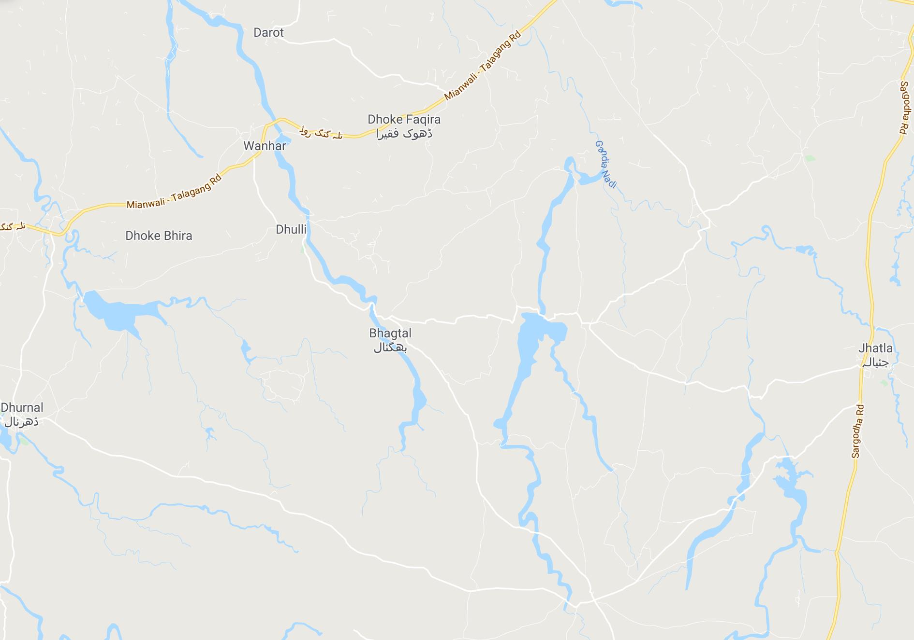
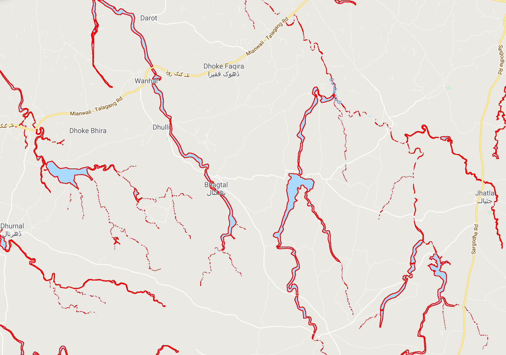

# Discovering-water-reservoir-from-Google-maps-using-Python-OpenCv
Discovering water reservoir from Google maps using Python &amp; OpenCV. It could be used to detect water resources in remote areas
which would be life saver in remote areas.

## Installation

Installation is simplest:

1. Clone the repository
2. Install dependencies with `numpy`, `python-opencv`
3. You are good to go!    

#### Installation notes

Formative Feedbacker depends on:
 1. `Open-CV`
 2. `Numpy`

## Usage

### Sample Input

### Sample Output

## Contributing

Feel free to submit pull requests to me.

## Authors

* **Muhammad Haseeb** - *Initial work* - [Muhammad Haseeb](https://github.com/iam-mhaseeb)

## Disclaimer

This project is MIT Licenced but you must take a look on libraries & frameworks used in this project before using in your commercial project.

## Licensing

[MIT Licenced](LICENSE)
